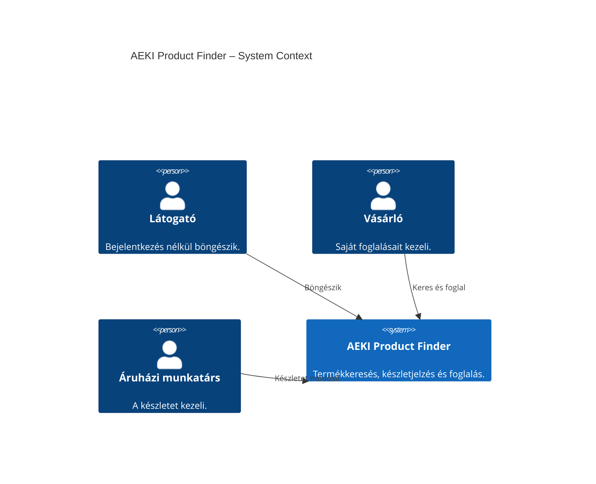

# AEKI Product Finder – C4 System Context

A három szereplő felül, az általuk használt rendszer alattuk helyezkedik el. A nyilak használati kapcsolatokat jelölnek. A demóhoz jelenleg nincs külső rendszerintegráció.

Ez a C4 első szintje: a rendszer belső felépítését a [Container diagram](02-containers.hu.md) mutatja. Követelmények: [appterv](../planning/AEKI-product-search-app-requirements.hu.md). Szintaxis: [Mermaid C4](https://mermaid.js.org/syntax/c4.html).
