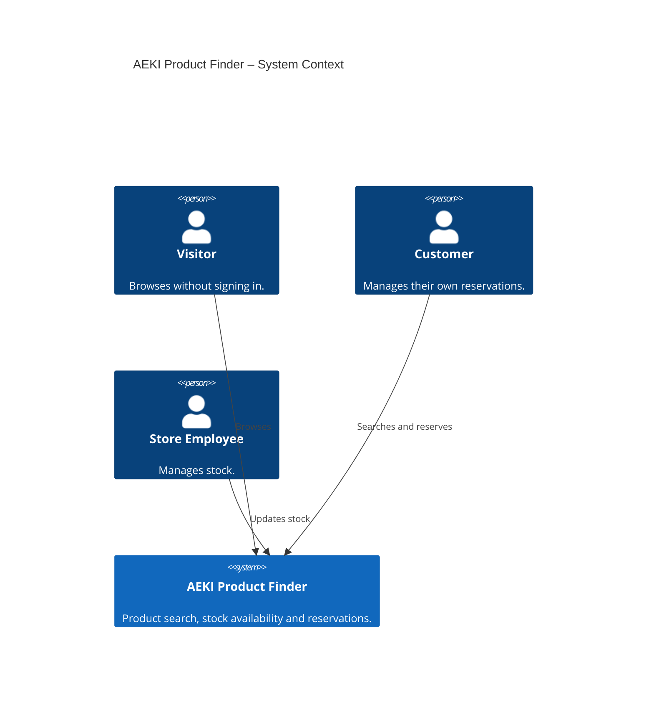

# AEKI Product Finder – C4 System Context

The three user roles appear in the top row, with the system below them. Arrows represent usage relationships. The demo currently has no external system integrations.

This is C4 level 1. The [Container diagram](02-containers.md) describes the system's internal applications and data store.

[Requirements](../planning/AEKI-product-search-app-requirements.hu.md) · [Mermaid C4 syntax](https://mermaid.js.org/syntax/c4.html).
