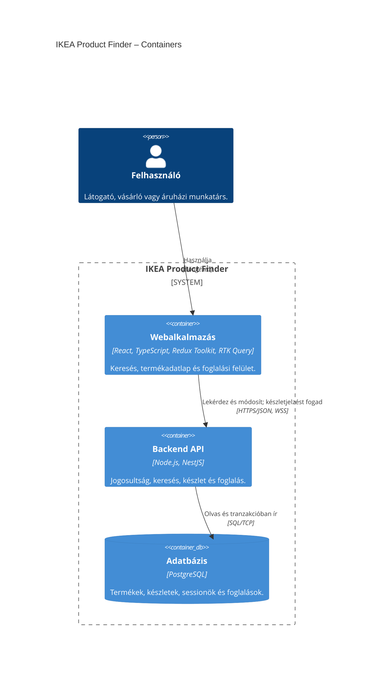

# IKEA Product Finder – C4 Container diagram

Az alapalkalmazás tervezett felépítése, felülről lefelé: felhasználó → webalkalmazás → API → adatbázis. A felhasználói szerepeket itt egy doboz foglalja össze; külön szerepköreiket a [System Context diagram](01-system-context.hu.md) mutatja.

## Felelősségek és kapcsolatok

| Container | Felelősség |
| --- | --- |
| Webalkalmazás | A böngészőben fut. Az RTK Query kezeli az API-adatokat és a cache-t; Redux slice csak közös kliensállapothoz kell. A keresőszöveg lokális, az alkalmazott keresési feltételek az URL-ben élnek. |
| Backend API | A Products, Inventory, Reservations és Auth modulok egy NestJS-alkalmazás részei. Itt történik a validáció, jogosultságkezelés, foglalás, lejáratkezelés és készletesemény küldése. |
| Adatbázis | Tartós adat és konzisztenciagarancia. Atomi foglalás, idempotencia, egyszeri felszabadítás és audit. A frontend közvetlenül nem éri el. |

A frontend → API kapcsolat a REST-kéréseket és a készletfrissítés WebSocket-csatornáját egyetlen vonalon foglalja össze. A készletesemény az API-tól érkezik a klienshez; a nyíl a kapcsolatot jelöli, nem minden üzenet irányát. A HTTPS/WSS az éles célkonfiguráció; helyi fejlesztésben HTTP/WS is használható.

A C4 container itt futtatható alkalmazást vagy adattárolót jelent; nem feltétlenül Docker-containert. Az RTK Query és a Nest modulok a saját alkalmazásuk belső részei.

## Tervezett B02 bővítés

A broker és az értesítő microservice a későbbi B02 gyakorlószelet része. Az alapdiagram a broker nélküli működő felépítést mutatja; a bővítéshez ezeket adjuk majd hozzá:

| Új container | Technológia | Kapcsolat és felelősség |
| --- | --- | --- |
| Üzenetbroker | Implementációkor kiválasztandó broker | A backend outbox-publikálója foglalási eseményt küld; az értesítő fogyasztja. |
| Értesítő microservice | Külön NestJS-alkalmazás, @nestjs/microservices | Esemény alapján szimulált értesítés, helyi napló/sink. Ismételt kézbesítésnél deduplikál. |

Az outbox-publikáló az első bővítésben a backend alkalmazás része; az outbox-rekord a PostgreSQL-ben, a foglalással közös tranzakcióban készül. Az értesítő deduplikációjához tartós, saját tulajdonú feldolgozási nyilvántartás kell; ennek tárolóját a bővítés tervezésekor rögzítjük. Külső email-szolgáltatás nincs a demóban.

Állapot: architektúraterv, még nem implementált alkalmazás. [Követelményspecifikáció](../planning/ikea-product-search-app-requirements.hu.md) · [Mermaid C4 szintaxis](https://mermaid.js.org/syntax/c4.html).
