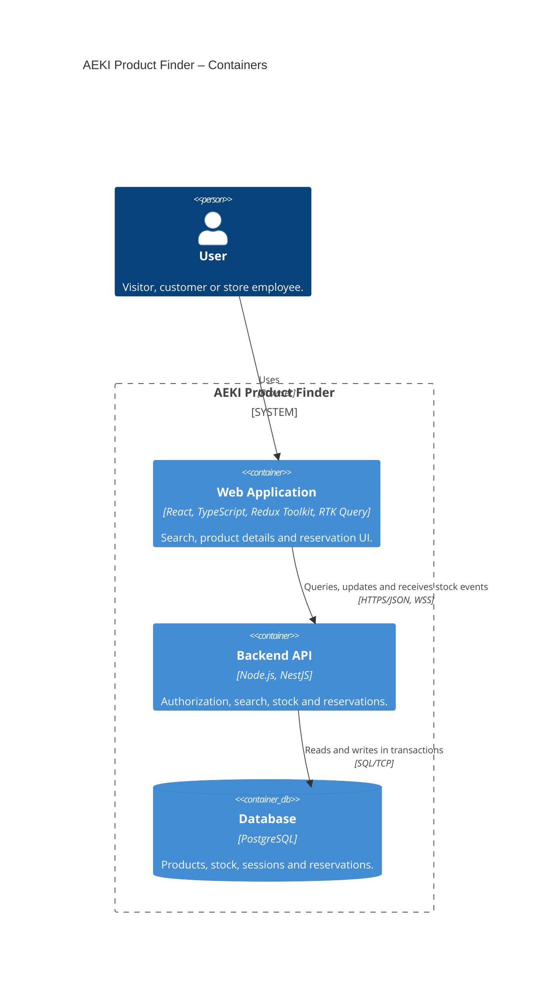

# AEKI Product Finder – C4 Container Diagram

The planned application is arranged from top to bottom: user → web application → API → database. This view combines the user roles into one element; the [System Context diagram](01-system-context.md) shows them separately.

## Responsibilities and Relationships

| Container | Responsibility |
| --- | --- |
| Web Application | Runs in the browser. RTK Query owns API data and caching; Redux slices hold shared client state when needed. The input text is local state, while applied search criteria live in the URL. |
| Backend API | Products, Inventory, Reservations and Auth modules belong to one NestJS application. It handles validation, authorization, reservations, expiration and stock events. |
| Database | Provides durable storage and consistency guarantees: atomic reservations, idempotency, exactly-once stock release and auditing. The frontend has no direct database access. |

The web application → API relationship combines REST requests and the WebSocket channel for stock updates. Stock events travel from the API to the client; the arrow represents a relationship rather than every message's direction. HTTPS/WSS is the production target; local development may use HTTP/WS.

A C4 container represents an executable application or a data store. It does not necessarily correspond to a Docker container. RTK Query and NestJS modules are internal parts of their respective applications.

The [Component diagram](03-components.md) shows the Backend API components and the data flow for search, sessions, reservations and stock updates.

## Planned B02 Extension

The broker and notification microservice belong to the later B02 practice slice. The diagram above shows the planned application before that extension.

| Additional Container | Technology | Relationship and Responsibility |
| --- | --- | --- |
| Message Broker | Selected during implementation | Receives reservation events from the backend outbox publisher; the notification service consumes them. |
| Notification Microservice | Separate NestJS application, @nestjs/microservices | Writes simulated notifications to a local log/sink and deduplicates repeated deliveries. |

Initially, the outbox publisher runs inside the backend application. The PostgreSQL outbox record is written in the same transaction as the reservation. The notification service needs its own durable processing records for deduplication; their storage will be selected when designing the extension. The demo does not use an external email provider.

**Status:** architecture proposal; the application has not been implemented.

[Requirements](../planning/AEKI-product-search-app-requirements.hu.md) · [Mermaid C4 syntax](https://mermaid.js.org/syntax/c4.html).
