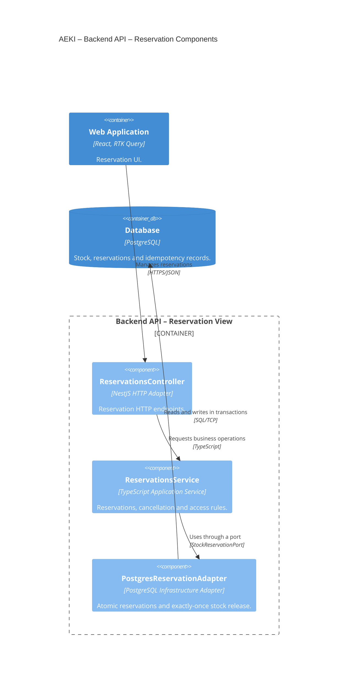

# AEKI Product Finder – C4 Component: Reservations

**Status:** proposed architecture; application code has not been implemented.

This C4 level 3 view expands the reservation functionality inside the **Backend API** container from the [Container diagram](02-containers.md). It focuses on one business slice to keep responsibilities and relationships readable. Product search, Auth and employee stock updates can have separate component views.

Components are arranged from top to bottom. The frontend and database appear outside the backend boundary. Arrows represent usage relationships rather than a complete execution sequence.

## Components and Contracts

| Component | Responsibility | Outside Its Responsibility |
| --- | --- | --- |
| ReservationsController | POST/GET/DELETE reservation endpoints; forwards validated requests and session context; maps results to HTTP responses | SQL, stock concurrency and transaction decisions |
| ReservationsService | Access to the user's own reservations; coordinates reservation operations, expiration/idempotency policies and business outcomes | HTTP/ORM dependencies and concrete locking SQL |
| PostgresReservationAdapter | Implements the port using the database; changes stock, creates reservations and records idempotency in one transaction; closes reservations and releases stock at most once | User interface state and client cache |

**StockReservationPort is a contract, not a separately running component.** The service depends on this business boundary; the adapter implements it. The diagram shows injected usage. Under DIP, the concrete adapter depends on the port declaration, while the service does not import PostgresReservationAdapter. NestJS requires a runtime injection token to bind the implementation.

The port must define contracts for the required operations: atomic reservation, fetching/listing the user's reservations and exactly-once stock release. The exact interface and any necessary separation will be reviewed before implementation. A generic CRUD interface is not required merely to match the diagram.

## Related Backend Components

The diagram shows the direct HTTP–service–adapter relationship. The planned backend also includes these collaborations:

- **Session/Auth component and guard:** identifies the user before the controller runs. Resource authorization for the user's own reservations also applies within the service operation.
- **OpenAPI schema validation pipe:** validates HTTP input before the controller requests a business operation. A DTO or TypeScript interface alone does not provide runtime validation.
- **Expiration handler:** invokes the reservation application operation in the background using the same exactly-once stock release guarantee. It does not invoke the operation through an artificial HTTP request.
- **InventoryGateway:** emits stock updates over WebSocket after a successful commit. It receives a signal after the reservation operation has committed; rollback must not emit a successful event. The client invalidates the relevant RTK Query cache and refetches.
- **Exception filter:** maps application errors to the consistent error responses defined in OpenAPI.

These supporting relationships are described separately to keep the main diagram readable. The complete temporal flow belongs in a Dynamic/sequence view. The broker and notification microservice remain part of the later B02 extension.

## Required Test Evidence

- Controller/HTTP integration: invalid input, missing session, another user's reservation and documented responses.
- Service/port boundary: correct business outcomes and access decisions.
- Real database adapter integration: competing reservations for the last item; idempotent retries; at-most-once release when cancellation and expiration race.
- Event integration: failed transactions do not produce successful stock events.
- Frontend integration/E2E: successful reservation displays the correct reservation and updated stock.

Test boundaries are agreed before TDD begins. A mocked port cannot prove database atomicity. This document describes the plan rather than completed test runs.

[Requirements](../planning/AEKI-product-search-app-requirements.hu.md) · [Engineering principles](engineering-principles.hu.md) · [C4 Component model](https://c4model.com/diagrams/component) · [Mermaid C4 syntax](https://mermaid.js.org/syntax/c4.html).
