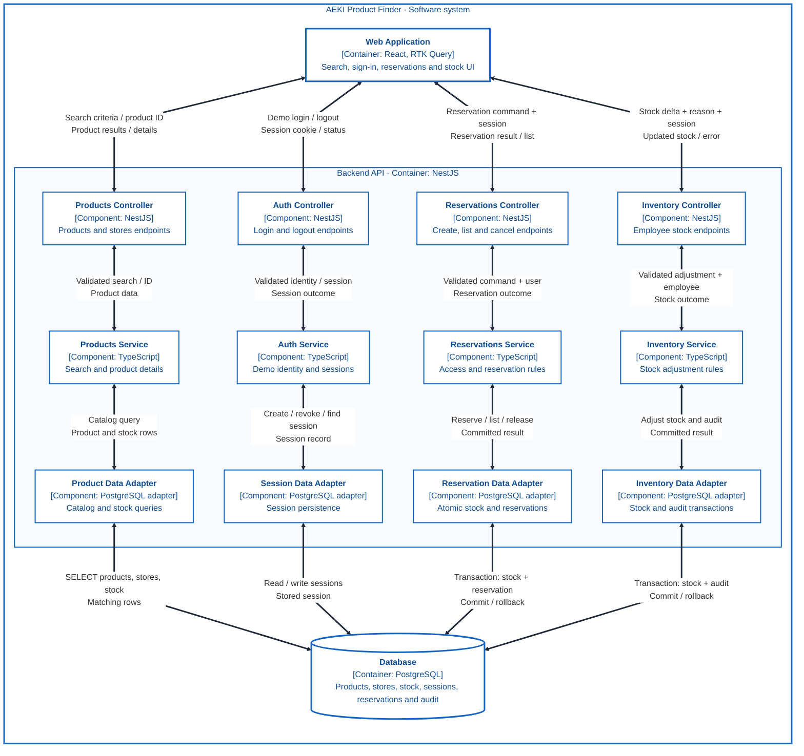
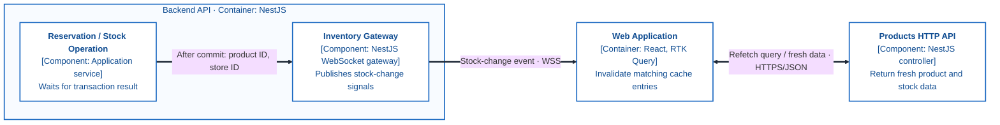

# AEKI Product Finder – Backend Components and Data Flow

**Status:** proposed architecture; application code has not been implemented.

This C4 level 3 view expands the [Backend API container](02-containers.md). Read it by column: the web application sends a request to a controller, the controller delegates to an application service, and the service accesses PostgreSQL through a data adapter. Results return through the same chain.

The outer boundary is the AEKI software system. The inner boundary is the NestJS backend container. PostgreSQL is a separate container, shared by the backend modules; the four columns do not represent separate microservices or databases.

## HTTP Data Flow

[Open the full-size SVG](diagrams/03-components.svg) to zoom into the four columns. The SVG is an export of the Mermaid diagram below, rendered with Mermaid 11.12.0; regenerate it when changing the diagram. Exported SVGs use explicit dark strokes and arrowhead fills so they remain visible in viewers that override embedded styles.

Each two-headed arrow represents a request and its response, not two independent calls. The first line names the request data or operation; the second names the returned data. HTTP links use HTTPS/JSON, internal links use TypeScript calls, and database links use parameterized SQL within the appropriate transaction boundary.

**Reading an example:** search criteria leave the UI, pass through Products Controller and Products Service, and reach Product Data Adapter. PostgreSQL returns matching product and stock rows. The adapter and service return product data; the controller serializes the documented JSON response. RTK Query caches the validated response and the UI renders it.

## Stock Events After Commit

[Open the full-size event SVG](diagrams/03-stock-events.svg).

This separate view shows the one-way event path. It complements the HTTP view without routing event arrows across all four columns.

The event is a refresh signal, not authority to reserve stock. The HTTP refetch follows the Products column above; the returned data updates the RTK Query cache. Rollback produces no successful stock-change event. Reconnection also triggers a refetch because WebSocket messages can be missed. The event payload and subscription rules require their own contract before implementation.

## Authentication and Validation

Protected HTTP requests carry the session cookie. A session guard resolves the session through the Auth module before the protected controller runs. An employee role is required for stock adjustment; reservation ownership is checked by the reservation operation. Search remains available to visitors.

OpenAPI-backed validation checks input at the HTTP boundary. Responses use the documented status and error shape. These shared guard, validation and error-mapping collaborators are described here rather than adding diagonal arrows across the main view. Session expiry, revocation, cookie policy and runtime validation must be tested at integration boundaries.

## Contracts and Transaction Boundaries

| Boundary | Data and guarantee |
| --- | --- |
| UI ↔ HTTP controllers | OpenAPI request/response contracts; runtime validation; session cookie where required; reservation creation includes an Idempotency-Key |
| Controllers ↔ services | Validated transport input becomes application input; user context is passed explicitly |
| Products ↔ data adapter | Search, pagination, product details and store stock; parameterized queries |
| Auth ↔ data adapter | Expiring, revocable sessions; no request-specific state in singleton providers |
| Reservations ↔ data adapter | StockReservationPort: atomically reserve stock, store the reservation and record idempotency; cancellation/expiration releases stock at most once |
| Inventory ↔ data adapter | Apply an authorized stock delta and persist its audit record in one transaction; coordinate with concurrent reservations |
| Application operations → gateway | Emit only after a successful commit; payload and delivery behavior are separate from HTTP responses |

Services depend on business-owned ports where a real persistence boundary requires them. Concrete PostgreSQL adapters implement those ports and are bound through NestJS runtime injection tokens. The diagram's data-flow arrows do not reverse the SOLID dependency rule: services do not need to import concrete adapters.

The expiration handler calls the reservation application operation without an artificial HTTP request. It shares the cancellation operation's at-most-once stock-release guarantee. The broker, outbox publisher and notification microservice remain the later B02 extension and are not part of this view.

## Required Test Evidence

- HTTP integration: documented contracts, invalid input, missing/expired session, role checks and reservation ownership.
- Search integration: correct filters, pagination and product/store stock data across the controller–service–database path.
- Database integration: competing reservations for the last item, idempotent retries, cancellation/expiration races and concurrent employee stock adjustments.
- Event integration: publication follows commit, failed transactions produce no success event, and clients refetch after reconnect.
- Frontend integration/E2E: request → response → RTK Query cache → rendered result, including errors and stale-response protection.

These are required future checks, not completed test runs.

[Requirements](../planning/AEKI-product-search-app-requirements.hu.md) · [Engineering principles](engineering-principles.hu.md) · [C4 Component model](https://c4model.com/diagrams/component) · [Mermaid flowchart syntax](https://mermaid.js.org/syntax/flowchart.html).
