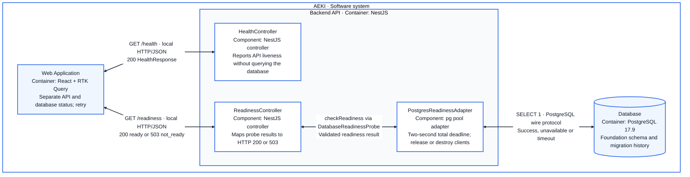

# AEKI — Implemented Foundation Components

**Status:** implemented in issues #1 and #2. This C4 level 3 view expands the current NestJS backend container. Product search, authentication, reservations and stock events remain planned in the [target component view](03-components.md).

Read from top to bottom: the React container makes independent HTTP requests; the readiness controller calls a database probe through its interface; the concrete adapter queries PostgreSQL. Two-headed arrows show a request and its response. Database access stays inside the backend.

The browser reaches Nest through Vite's `/api/` proxy in development. HTTPS is a production target, not a claim about this local HTTP setup. `HealthPage`, `ReadinessStatus`, `ReadinessView` and the injected RTK Query endpoints live inside the React container; they are not independently deployed services.

`AppModule` binds the `databaseReadinessToken` to the adapter. The controller depends on the narrow `DatabaseReadinessProbe` contract; it does not import the database driver. Missing/malformed configuration fails startup with sanitized diagnostics. A configured but unavailable database leaves the API alive and returns not-ready. Pool cleanup runs on Nest shutdown.

The web validates response JSON using generated OpenAPI schemas. Expected schema-valid 503 responses show database not-ready; invalid payload/status combinations and transport failures have distinct feedback. Readiness proves connectivity only, not schema completeness or write permissions. `node-pg-migrate` initializes the foundation schema/history outside the HTTP request path; no product tables exist yet.

See [current containers and target architecture](02-containers.md), [ADR-0005](adr/0005-postgresql-readiness-and-migrations.md) and [issue #2 evidence](../engineering/sessions/2026-10-03-postgresql-readiness-implementation.md).
