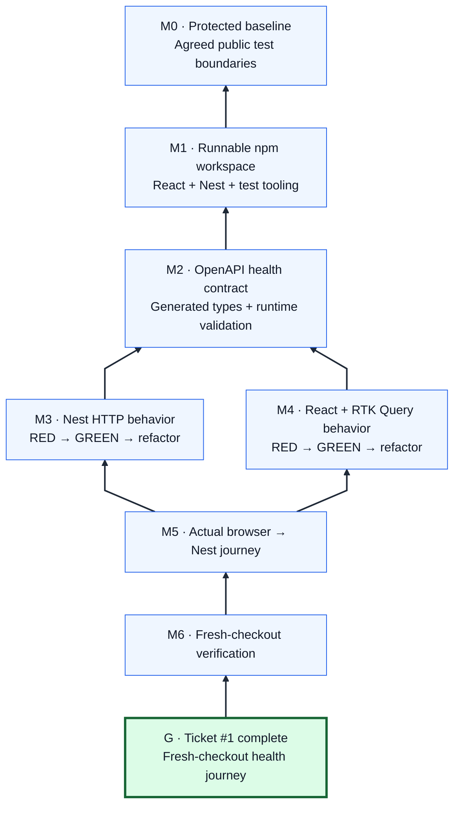

# Issue #1 — Provisional Mikado Graph

Arrows mean **requires**. Goal at the bottom; prerequisites above it. Implement from the upper leaves toward the goal. All implementation nodes are planned, not experimentally completed. See the [plan](../issue-1-mikado-plan.md) for probes, acceptance evidence and undo policy.

Suggested working order: M0 → M1 → M2 → M3 → M4 → M5 → M6 → G. M3/M4 have no dependency on each other; the sequence is a preference, not another blocking edge.
