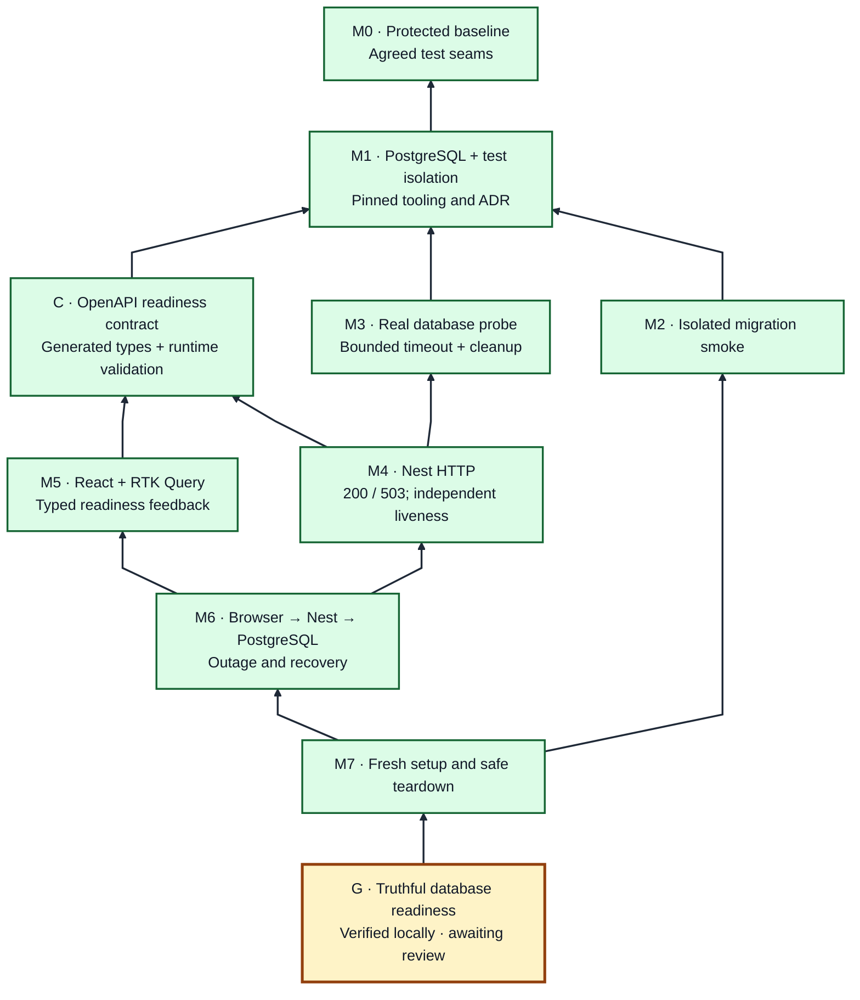

# Issue #2 — Verified Mikado Graph

Arrows mean **requires**. Goal at the bottom. Green prerequisite nodes have local verification evidence; the goal awaits user review. See the [plan](../issue-2-mikado-plan.md) for experiments and acceptance evidence.

M5 requires C, not the completed backend implementation. Migration smoke is a separate delivery prerequisite; it is not falsely made a dependency of a connectivity-only query.
