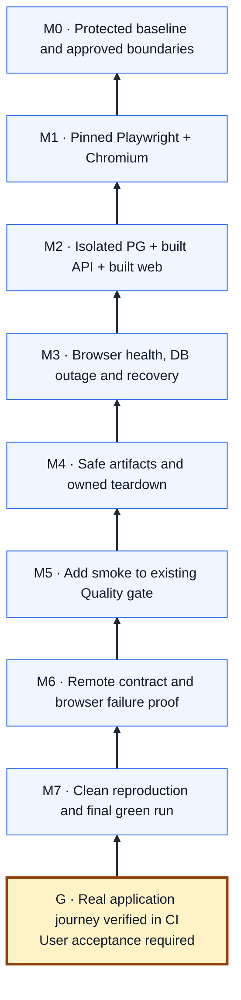

# Issue #3 — Proposed Mikado Graph

Status: implementation verified; delivery acceptance pending. Arrows mean **requires**; the goal is at the bottom. The graph records the accepted dependency plan; observed experiments are tracked in the [implementation session](../../engineering/sessions/2026-10-05-issue-3-browser-ci.md). See the [plan](../issue-3-mikado-plan.md).

Existing format, contract, type, build, PostgreSQL integration and coverage gates remain delivery prerequisites. The linear shape communicates the proposed first execution order; new prerequisite branches are added only when actual experiments uncover them.
