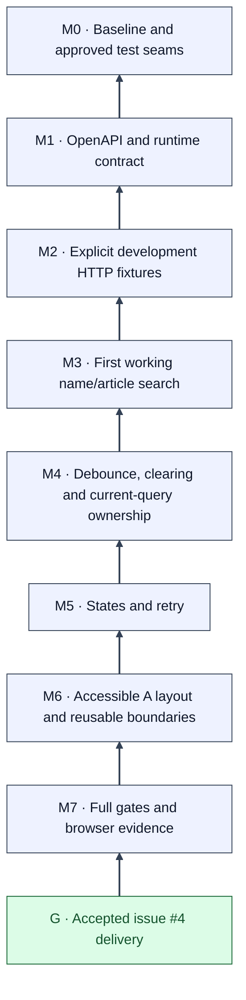

# Issue #4 — Mikado Dependency Graph

Arrows mean **requires**. The goal is at the bottom. These approved nodes are implemented locally; [verification evidence](../../engineering/sessions/2026-10-05-issue-4-implementation.md) records actual checks. Delivery acceptance remains pending.

